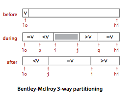

## 排序
排序的抽象方法
```
public class Example {
	public static void sort(Comparable[] a) { 
		// 具体的实现
	}

 	private static boolean less(Comparable v, Comparable w) { 
 		return v.compareTo(w) < 0;
 	}

	private static void exch(Comparable[] a, int i, int j) {
		Comparable t = a[i];
		a[i] = a[j];
		a[j] = t;
	}

 	private static void show(Comparable[] a) {
 		// Print the array, on a single line.
		for (int i = 0; i < a.length; i++)
			System.out.println(a[i] + " ");
	}

	public static boolean isSorted(Comparable[] a) {
 		// Test whether the array entries are in order.
		for (int i = 1; i < a.length; i++)
			if (less(a[i], a[i-1])) return false;
		return true;
	}

	public static void main(String[] args) { 
	 	// Read strings from standard input, sort them, and print.
		String[] a = In.readStrings();
		sort(a);
		assert isSorted(a);
		show(a);
	}
}
```
### 基本排序ElementarySorts
#### 选择排序[SelectionSort](sorts/Selection.java)

每次选择最小的元素，将其放入正确的位置。
1. 在[0,n)找到数组中最小的元素，将它与第1个元素交换；
2. 再在[1, n)中找到最小的元素，将它与第2个元素交换；
3. 依次查找并交换，即将数组排序。

比较：$N((N - 1) + 0)/2 ~= N^2$次，
交换：最差N次，最优0次。

```
public void sort(Comparable[] a) {
	// Sort a[] into increasing order.
	int N = a.length;
	for (int i = 0; i < N; i++) {
		// Exchange a[i] with smallest entry in a[i+1...N).
		int min = i; // index of minimal entr.
 		for (int j = i + 1; j < N; j++) {
 			if (less(a[j], a[min])) min = j;
 		}
		exch(a, i, min);
	}
}
```

#### 插入排序[Insertion sort](sorts/Insertion.java)
依次将每个元素插入已排序的序列中合适的位置。
1. 比较前两个元素，将其正确排序
2. 将第3个元素依次与前两个元素比较，插入合适的位置；可倒序迭代比较，若第3个元素小于第2个，交换并继续比较前两个，依次比较并交换。
3. 依次取每个元素，与前面的倒序迭代比较，若小于则交换位置，直到大于等于则停止。

最差：比较N^2/2次，交换N^2/2次。
最优：比较N-1次，交换0次。
平均：比较N^2/4次，交换N^2/4次。
```
public static void sort(Comparable[] a) {
	// Sort a[] into increasing order.
 	int N = a.length;
 	for (int i = 1; i < N; i++) { 
	 	// Insert a[i] among a[i-1], a[i-2], a[i-3]... ..
	 	for (int j = i; j > 0 && less(a[j], a[j-1]); j--) {
		 	exch(a, j, j-1);
	 	}
	}
}
```

适用场景：
- 数组中大部分数据已排序，只有少数未正确排序
- 一个大的已排序的数组后边拼接了一个小的未排序的数组

#### 希尔排序[Shellsort](sorts/Shell.java)
希尔排序是基于插入排序的一种优化，将原始列表分解为多个较小的子列表来改进插入排序，每个子列表使用插入排序进行排序，之后减小分组间隔，再次排序，直到间隔为1；因此又称为缩小增量排序。希尔排序是不稳定的排序方法。
1. 选取一个增量数值h，将数组分为h组，每组为i, i + h, i + 2h...
2. 对h组子列表分别进行插入排序
3. 减小h
4. 再次重复1、2、3步骤，直到h最小减到1，此时即为标准的插入排序

- 最佳情况：O(NlogN)
- 最坏情况：O(N^2)

增量h的选择：一般情况下选择N/x，然后每次除以x，直到减小为1

```
public static void sort(Comparable[] a) {
	// Sort a[] into increasing order.
	int N = a.length;
	int h = 1;
	// 先选择为N/3，再每次/3
	while (h < N/3) {
		h = 3*h + 1; // 1, 4, 13, 40, 121, 364, 1093, ...
	}
	while (h >= 1) { 
		// h-sort the array.
		for (int i = h; i < N; i++) {
			// Insert a[i] among a[i-h], a[i-2*h], a[i-3*h]... .
			for (int j = i; j >= h && less(a[j], a[j-h]); j -= h) {
				exch(a, j, j-h);
			}
		}
		h = h/3;
	}
}
```
### 归并排序MergeSort
将一个大的数组拆分成几个小的数组分别排序，再将排好序的子数组合并起来，得到最终的排序结果。

合并方法：
```
public static void merge(Comparable[] a, int lo, int mid, int hi) { 
	// Merge a[lo..mid] with a[mid+1..hi].
	if (a[lo] <= a[mid+1]) {
		// 当前半部分的最后一个数值比后半部分第一个数值小或相等时，则已经排好序，直接返回
		return;
	}
	if (a[lo] >= a[hi]) {
		// 当前半部分的第一个数值比后半部分最后一个数值大或相等时，则将后边的数组整个放到前边数组之前即可
		int halfLength = (hi - lo + 1) / 2 + 1;
		for (int k = lo; k < mid; k++) {
			exch(a, k, k + halfLength);
		}
		if ((mid + halfLength) <= hi) {
			exch(a, mid, mid + halfLength);
		}
		return;
	}
	// 前后两部分两个指针的初始化
	int i = lo, j = mid+1;
	// 使用辅助数组把整个数组复制一份
	for (int k = lo; k <= hi; k++) {
		// Copy a[lo..hi] to aux[lo..hi].
		aux[k] = a[k];
	}
	for (int k = lo; k <= hi; k++) { // Merge back to a[lo..hi].
		if (i > mid) {
			// 前指针移动到尾部，直接取后指针的值
			a[k] = aux[j++];
		} else if (j > hi ) {
			// 后指针移动到尾部，直接取前指针的值
			a[k] = aux[i++];
		} else if (less(aux[j], aux[i])) {
			// 后指针的数值较小时，取后指针的数值，并移动指针
			a[k] = aux[j++];
		} else {
			// 前指针的数值较小或相等时，取前指针的数值，并移动指针
			a[k] = aux[i++];
		}
	}
}
```

#### 自顶向下的[归并排序](sorts/Merge.java)
将数组二分，各自进行排序，再把排好序的两个数组归并。对于这两个数组，每个又进行二分，递归排序及合并。

```
public class Merge {
	private static Comparable[] aux; // auxiliary array for merges
	public static void sort(Comparable[] a) {
	aux = new Comparable[a.length]; // Allocate space just once.
		sort(a, 0, a.length - 1);
	}
	private static void sort(Comparable[] a, int lo, int hi) { 
 		// Sort a[lo..hi].
 		if (hi <= lo) {
 			return;
 		}
		int mid = lo + (hi - lo)/2;
		sort(a, lo, mid); // Sort left half.
		sort(a, mid+1, hi); // Sort right half.
		merge(a, lo, mid, hi); // Merge results
	}
}
```

#### 自底向上的[归并排序](sorts/MergeBU.java)
先将数组中的元素两两排序（即当作是两个长度是1的数组进行归并），再四个四个进行归并，依次递归归并直到归并了整个数组，即完成排序。

```
public class MergeBU {
	private static Comparable[] aux; // auxiliary array for merges
	public static void sort(Comparable[] a) { 
		// Do lg N passes of pairwise merges.
		int N = a.length;
		aux = new Comparable[N];
		for (int sz = 1; sz < N; sz = sz+sz) {
			// sz: subarray size
			for (int lo = 0; lo < N-sz; lo += sz+sz) {
				// lo: subarray index
				merge(a, lo, lo+sz-1, Math.min(lo+sz+sz-1, N-1));
			}
		}
	}
} 
```
使用链表进行归并排序时，不需要辅助数组，可以进行原地排序。

自底向上的归并排序进行比较次数：1/2NlgN ~ NlgN，访问数组次数最多为6NlgN

归并排序适用于数量较大的数组的排序。二分后若子数组较小（小于15）可使用插入序等方式来提高效率。

### 快速排序[QuickSort](sorts/Quick.java)
对于归并排序，将数组细分，分别排序，之后归并。若找到一个合适的位置将数组分为两部分，将两个数组排序后不用再迭代归并，而是直接完成排序，那排序将会快很多。

1. 找到合适的划分位置，将数组分为两部分，分别排序，即完成排序。
2. 对于分开的两个数组，再递归划分为两部分；分至1-2个元素的子数组即可进行排序。


选择划分位置，在于将小于某数的值放到数组左边，大于等于的数值放到右边
1. 选择第一个元素作为中位数；取两个指针i, j分别从首尾出发向中间行进
2. i先向后递增，找到第一个小于中位数的值，停止；j从尾部向前递减，找到第一个大于中位数的值；将两者交换（实现将较小的数前置，将较大的值后置）
3. 当i >= j时停止；或i, j走到数组尽头时亦停止
4. 上述全部交换完成后，将中位数放到数组中间，即将lo和j的数值交换
5. 返回中位数的位置j

```
public class Quick {
	public static void sort(Comparable[] a) {
		StdRandom.shuffle(a); // Eliminate dependence on input.
		sort(a, 0, a.length - 1);
	}
	
	private static void sort(Comparable[] a, int lo, int hi) {
		if (hi <= lo) {
			return;
		}
		// 为了在子数组较小时更有效地排序，可使用插入排序法，将上边三行代码改为下边的：
//		int M = 5; // 当子数组长度为5~15时，改用插入排序
//		if (hi <= lo + M) {
//			Insertion.sort(a, lo, hi);
//			return;
//		}
		int j = partition(a, lo, hi); // Partition (see page 291).
		sort(a, lo, j-1); // Sort left part a[lo .. j-1].
		sort(a, j+1, hi); // Sort right part a[j+1 .. hi].
	}
}

private static int partition(Comparable[] a, int lo, int hi) {
	// Partition into a[lo..i-1], a[i], a[i+1..hi].
	int i = lo, j = hi+1; // left and right scan indices
	Comparable v = a[lo]; // partitioning item
	while (true) { 
		// Scan right, scan left, check for scan complete, and exchange.
		while (less(a[++i], v)) {
			if (i == hi) {
				break;
			}
		}
		while (less(v, a[--j])) {
			if (j == lo){
				break;
			}
		}
		if (i >= j) {
			break;
		}
		exch(a, i, j);
	}
	exch(a, lo, j); // Put v = a[j] into position
	return j; // with a[lo..j-1] <= a[j] <= a[j+1..hi].
}
```

平均比较约2NlnN次，交换1/6NlnN次
#### 快速排序的优化
##### 切换到插入排序

在数组中元素较少时，插入排序更快速，故可在数组元素较少（一般5~15个元素）时改用插入排序来提高效率。

##### 三取样切分
在选择切分元素时，若能合理切分数组（如正好分成两等份），则可以提高排序效率，一种方法是，抽取三个数，选择其位数作为切分元素，则可以较好地选择到一个合适的数字。

```
private static final int CUTOFF = 8;
private static void sort(double[] a, int lo, int hi) { 
    // cutoff to insertion sort
    int n = hi - lo + 1;
    // 元素个数较少时，采用插入排序法
    if (n <= CUTOFF) {
        insertionSort(a, lo, hi);
        return;
    }
    // 取样三个数，取其中位数
    int m = median3(a, lo, lo + n/2, hi);
    // 将切分元素放到第首位
    exch(a, m, lo);
    // 按照快速排序法排序
    int j = partition(a, lo, hi);
    show(a, lo, j, j, hi);
    sort(a, lo, j-1);
    sort(a, j+1, hi);
}

private static void insertionSort(double[] a, int lo, int hi) {
    for (int i = lo; i <= hi; i++)
        for (int j = i; j > lo && less(a[j], a[j-1]); j--)
            exch(a, j, j-1);
}


// return the index of the median element among a[i], a[j], and a[k]
private static int median3(double[] a, int i, int j, int k) {
    return (less(a[i], a[j]) ?
           (less(a[j], a[k]) ? j : less(a[i], a[k]) ? k : i) :
           (less(a[k], a[j]) ? j : less(a[k], a[i]) ? k : i));
}
```
##### [三向切分](sorts/Quick3way.java)的快速排序

当要排序的数组中存在大量重复元素（如按照性别排序）时，快速排序法退化至O(N^2)。诸如此类数据，又有荷兰国旗问题：荷兰国旗由红白蓝三色横条纹组成；有许多红白蓝条纹需要把这些条纹按照颜色排好，相同颜色在一起，从上到下为红白蓝。

对于此种情况，可以将数组三分，左侧的小于参考值，中间的等于参考值，右侧大于参考值。切分完之后，再将每个子数组进行三向切分快速排序。Quicksort with 3-way partitioning.

```
public class Quick3way {
	private static void sort(Comparable[] a, int lo, int hi) { 
    	if (hi <= lo) {
    		return;
    	}
        int lt = lo, gt = hi;
        Comparable v = a[lo];
        int i = lo + 1;
        // i在lt和gt之间
        while (i <= gt) {
            int cmp = a[i].compareTo(v);
            if (cmp < 0) {
            	// 交换后，lt向右移，i亦自增右移
            	exch(a, lt++, i++);
            } else if (cmp > 0) {
            	// 交换后，gt向左扩展
            	exch(a, i, gt--);
            	// 交换后i不自增而gt左移，再次比较交换后的i和现在的gt
            } else {
            	// 两个元素相等时只移动i
            	i++;
            }
        }

        // a[lo..lt-1] < v = a[lt..gt] < a[gt+1..hi]. 
        // 切分完之后，再将每个子数组进行三向切分快速排序。
        // 若已知数组中只有两2个或3个不同的数据时，下边的几行代码则不需要执行即完成排序
        sort(a, lo, lt-1);
        sort(a, gt+1, hi);
        assert isSorted(a, lo, hi);
    }
}
```

##### [快速三向切分](sorts/QuickBentleyMcIlroy.java)
Fast three-way partitioning用将重复元素放置于子数组两端的方式实现一个信息量最优的排序算法。使用两个索引p和 q，使得a[lo..p-1] 和 a[q+l..hi] 的元素都和 a[lo]相等。使用另外两个索引i和j，使得a [p..i-1]小于a[lo]，a[j+i..q]大于a[lo] 。在内循环中加入代码，在a[i]和v相当时将其与a[p]交换并将p加1) ，在a[j]和v 相等且a[i]和a[j]尚未和v进行比较之前将其与a[q]交换。添加在切分循环结束后将和v相等的元素交换到正确位置。

```
private static void sort(Comparable[] a, int lo, int hi) { 
    int n = hi - lo + 1;

    // cutoff to insertion sort
    if (n <= INSERTION_SORT_CUTOFF) {
        insertionSort(a, lo, hi);
        return;
    }

    // use median-of-3 as partitioning element
    else if (n <= MEDIAN_OF_3_CUTOFF) {
        int m = median3(a, lo, lo + n/2, hi);
        exch(a, m, lo);
    }

    // use Tukey ninther as partitioning element
    else  {
        int eps = n/8;
        int mid = lo + n/2;
        int m1 = median3(a, lo, lo + eps, lo + eps + eps);
        int m2 = median3(a, mid - eps, mid, mid + eps);
        int m3 = median3(a, hi - eps - eps, hi - eps, hi); 
        int ninther = median3(a, m1, m2, m3);
        exch(a, ninther, lo);
    }

    // Bentley-McIlroy 3-way partitioning
    int i = lo, j = hi+1;
    int p = lo, q = hi+1;
    Comparable v = a[lo];
    while (true) {
        while (less(a[++i], v))
            if (i == hi) break;
        while (less(v, a[--j]))
            if (j == lo) break;

        // pointers cross
        if (i == j && eq(a[i], v))
            exch(a, ++p, i);
        if (i >= j) break;

        exch(a, i, j);
        if (eq(a[i], v)) exch(a, ++p, i);
        if (eq(a[j], v)) exch(a, --q, j);
    }


    i = j + 1;
    for (int k = lo; k <= p; k++)
        exch(a, k, j--);
    for (int k = hi; k >= q; k--)
        exch(a, k, i++);

    sort(a, lo, j);
    sort(a, i, hi);
}

// does v == w ?
private static boolean eq(Comparable v, Comparable w) {
    if (v == w) return true;    // optimization when reference equal
    return v.compareTo(w) == 0;
}
```

##### [KR快速排序](sorts/QuickKR.java)
```
private static void sort(Comparable[] a, int lo, int hi) { 
    if (hi <= lo) return;
    exch(a, lo, (lo + hi) / 2);  // use middle element as partition
    int last = lo;
    for (int i = lo + 1; i <= hi; i++)
        if (less(a[i], a[lo])) exch(a, ++last, i);
    exch(a, lo, last);
    sort(a, lo, last-1);
    sort(a, last+1, hi);
}
```

##### [Dual pivot quicksort](sorts/QuickDualPivot.java)
```
private static void sort(Comparable[] a, int lo, int hi) { 
	if (hi <= lo) return;

	// make sure a[lo] <= a[hi]
	if (less(a[hi], a[lo])) exch(a, lo, hi);

	int lt = lo + 1, gt = hi - 1;
	int i = lo + 1;
	while (i <= gt) {
		if       (less(a[i], a[lo])) exch(a, lt++, i++);
		else if  (less(a[hi], a[i])) exch(a, i, gt--);
		else                         i++;
	}
	exch(a, lo, --lt);
	exch(a, hi, ++gt);

	// recursively sort three subarrays
	sort(a, lo, lt-1);
	if (less(a[lt], a[gt])) sort(a, lt+1, gt-1);
	sort(a, gt+1, hi);

	assert isSorted(a, lo, hi);
}
```

### 优先级队列PriorityQueues
