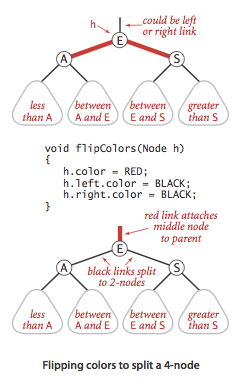

# 3.3-平衡二叉查找树BalancedSearchTrees
二叉查找树在最差情况下会退化成链表，为了保证对数级的查找速度，需要保证二叉树的平衡，即保证二叉树任意结点的左右子树高度相差不大于1。

> [平衡二叉树](https://algs4.cs.princeton.edu/33balanced)：任意节点的子树的高度差都小于等于1的二叉树。

## 2-3查找树
一棵二叉树一般只允许结点中保存一个键，一个结点有两个子结点，这样的结点称为`2-`结点；我们扩展一下，让每个结点可存储两个键，并可以有三个子结点，称为`3-`结点。那么可以构建一棵`2-3`查找树，用它来实现二叉树的平衡。


### 查找
类似于二叉查找树的查找方式，将目标值与结点对比：
- 若结点为空，则返回空
- 若等于结点中其中一个的值，则返回
- 若比结点所有值小，则向左子树查找
- 若在结点存在两个值且目标值处于两个值中间，则向中子树查找
- 若比结点所有值大，则向右子树查找

### 插入
#### 向2-结点中插入新键
在二叉查找树中插入新键，会加入新结点，而无法保持平衡。在`2-3`树中插入时，若查找到要插入的结点为`2-`结点时，直接将键插入到该结点中，即保证了树的平衡。


#### 向3-结点中插入新键
向3-结点中插入新键需考虑以下几种情况：
##### 一棵只有一个3-结点的树
先从最简单的情况出发，若一棵树只有一个`3-`结点：
- 先将键插入`3-`结点，成为一个`4-`结点，具有4个子链接
- 将`4-`结点分解为一棵`2-3`树，首先找到三个键的中间值
- 将中值提升为父结点，左右子树为其他两个键值，分别带上4个子链接中的两个子链接


##### 3-结点的父结点为2-结点
步骤同上，但在将中值提升为父结点后，要把它放入父结点中。此时父结点中有两个键，符合树的定义，亦保持了树的平衡。


##### 3-结点的父结点为3-结点
步骤亦同上，将中值提升为父结点并放入父结点后，此时父结点也有了3个结点，需要将此结点再次拆分，提取中值向上成为父结点；当父结点中存在3个结点，则不断递归向上抽取。


可见，`2-3`树是自底向上增长的，并保证了二叉树的平衡性，特性是：任意空链接到根结点的路径长度都是相等的。

## 红黑二叉查找树
红黑二叉查找树是用标准的二叉查找树（完全由`2-`结点构成) 和一些额外的信息（替换`3-`结点）来表示`2-3`树。我们将`2-3`树中的链接分为两种类型：*红链接*将两个`2-`结点连接起来构成一个`3-`结点，*黑链接*则是`2-3`树中的普通链接。即将`3-`结点表示为由一条左斜的红色链接相连的两个`2-`结点。


红黑树的另一种定义是含有红黑链接并满足下列条件的二叉查找树：
- 红链接均为左链接；
- 没有任何一个结点同时和两条红链接相连；
- 该树是完美黑色平衡的，即任意空链接到根结点的路径上的黑链接数量相同。

一个结点的颜色可通过`boolean`值来表示，`true`为红色。一个结点的左链接为红色，则可将其左结点表示为红色，于是，链接的颜色在结点中得到了体现，那么红黑树即是包括了红黑两种颜色结点的树，默认最终的叶子结点为空结点，是黑色。

### 红黑树的旋转
在对二叉树进行某些操作后（如插入结点时，使用红色链接），可能出现红色右链接或者两条连续的红链接，那么就需要进行旋转并修复。旋转保持了红黑树的有序性和完美平衡。

#### 左旋
将一个结点的右子树向左旋转：将根结点和右子树的根结点向左旋转，即将右子树的根结点旋转至根结点的位置，其颜色变为原根结点的颜色，而根结点作为此结点的左子结点，其颜色变为原右子树根结点的颜色；那么原来左子树的左子树呢，可见其值大于原来的根结点，所以将其作为原来根结点的右子树。

```
private Node rotateLeft(Node h) {
    // assert (h != null) && isRed(h.right);
    Node x = h.right;
    h.right = x.left;
    x.left = h;
    x.color = x.left.color;
    x.left.color = RED;
    x.size = h.size;
    h.size = size(h.left) + size(h.right) + 1;
    return x;
}
```


#### 右旋
同理，右旋是将左子树作为根结点，根结点作为其右子结点，而原来的左子树的右子树作为原来根结点的左子树。

```
private Node rotateRight(Node h) {
    // assert (h != null) && isRed(h.left);
    Node x = h.left;
    h.left = x.right;
    x.right = h;
    x.color = x.right.color;
    x.right.color = RED;
    x.size = h.size;
    h.size = size(h.left) + size(h.right) + 1;
    return x;
}
```


### 红黑树插入
#### 向2-结点（黑色结点）插入新键
插入键时，我们使用红色链接将它与父结点连接。向`2-`结点插入新键，则会在结点下增加一个新的结点，若键值小于结点的值，则产生一个左倾的红色链接，则完成插入；若键值大于结点，则产生一个右倾的红色链接，是违背定义的，此时需要进行一次左旋。

#### 向3-结点（左结点为红色）中插入新键
此时会使一个结点上连接了两个红色链接，需要通过旋转来解决，分三种情况

##### 新键值最大
此时将新键插入为右结点，根结点连接两条红色链接，但树是平衡的，我们所需要做的就是将这两个链接都变成黑色的即可。

##### 新键值最小
此时将新键插入为左结点的左结点，原来左结点的上下连接两条红色链接，此时将上层的红链接右旋一次即可得到第一种情况（左右两条红色链接），将链接变黑即可。

##### 新键处理中间值
此时新键将成为左结点的右结点，原来左结点上层连接一条左倾的红色链接，下层连接一条右倾的红色链接。此时先将下层进行一次左旋即得到第二种情况（上下两层左倾的红色链接），接下来处理方式同上，上层右旋，再变色即可。

在上述三种操作之后，需要注意的是，两条红色链接变黑之后，需要同时把根结点变为红色，此后需要递归判断上层是否存在两条红色链接，不断重复旋转操作，只到满足红黑树的定义。又知，整棵树的根结点始终为黑色，因此最终要将整棵树的根结点设为黑色。

变色代码如下：

```
private void flipColors(Node h) {
    // h must have opposite color of its two children
    // assert (h != null) && (h.left != null) && (h.right != null);
    // assert (!isRed(h) &&  isRed(h.left) &&  isRed(h.right))
    //    || (isRed(h)  && !isRed(h.left) && !isRed(h.right));
    h.color = !h.color;
    h.left.color = !h.left.color;
    h.right.color = !h.right.color;
}
```



在上述的操作中，可以看到对红黑树的操作和对`2-3`树的操作是相同的，旋转操作就是为了把中间值作为父结点，并把它放入上层父结点中，若上层为`3-`结点，则层层递归向上传递（红黑树中表现为红色链接的层层向上传递）。

综上，红黑树的插入操作分为以下几种：

- 如果右子结点是红色的而左子结点是黑色的，进行左旋转；
- 如果左子结点是红色的且它的左子结点也是红色的，进行右旋转
- 如果左右子结点均为红色，进行颜色转换。

插入方法的实现：
```
public void put(Key key, Value val) { 
    // Search for key. Update value if found; grow table if new.
    root = put(root, key, val);
    root.color = BLACK;
}

private Node put(Node h, Key key, Value val) {
    if (h == null) {
        // Do standard insert, with red link to parent.
        return new Node(key, val, 1, RED);
    }
    int cmp = key.compareTo(h.key);
    if (cmp < 0) {
        h.left = put(h.left, key, val);
    } else if (cmp > 0) {
        h.right = put(h.right, key, val);
    } else {
        h.val = val;
    }
    if (isRed(h.right) && !isRed(h.left)) {
        h = rotateLeft(h);
    }
    if (isRed(h.left) && isRed(h.left.left)) {
        h = rotateRight(h);
    }
    if (isRed(h.left) && isRed(h.right)) {
        flipColors(h);
    }
    h.N = size(h.left) + size(h.right) + 1;
    return h;
} 
```

### 红黑树的删除
为了保持树的平衡，删除一个结点后还需要进行一系列的操作来实现。先来考虑几个问题：
#### 2-3-4树的插入
为了向`2-3-4`树插入键，类似的，需要自顶向下分解`4-`结点，才可以插入新键：

1. 将`4-`结点表示为由3个`2-`结点组成的一棵子树，三个结点都用红色链接相连
2. 向下分解所有`4-`结点并进行颜色转换
3. 在向上的过程中用旋转将`4-`结点配平

只用将`put`方法中最后的`if`移动到`null`和比较之间：

```
public void insert(Key key, Value val) { 
    // Search for key. Update value if found; grow table if new.
    root = put(root, key, val);
    root.color = BLACK;
}

private Node insert(Node h, Key key, Value val) {
    if (h == null) {
        // Do standard insert, with red link to parent.
        return new Node(key, val, 1, RED);
    }
    if (isRed(h.left) && isRed(h.right)) {
        flipColors(h);
    }
    int cmp = key.compareTo(h.key);
    if (cmp < 0) {
        h.left = put(h.left, key, val);
    } else if (cmp > 0) {
        h.right = put(h.right, key, val);
    } else {
        h.val = val;
    }
    if (isRed(h.right) && !isRed(h.left)) {
        h = rotateLeft(h);
    }
    if (isRed(h.left) && isRed(h.left.left)) {
        h = rotateRight(h);
    }
    h.N = size(h.left) + size(h.right) + 1;
    return h;
} 
```

#### 删除最小键
直接删除`2-`结点后，会留下一个空结点，导致树的不平衡，因此需要先变换使树的结点为`3-`或临时的`4-`结点：
- 若当前结点的左子结点不是`2-`结点，完成
- 若根是`2-`结点且它的两个子结点都是`2-`结点，我们可以直接将这三个结点变成一个`4-`结点
- 若当前结点的左子结点是`2-`结点而它的亲兄弟结点不是`2-`结点，将左子结点的兄弟结点中的一个键移动到左子结点中
- 如果当前结点的左子结点和它的兄弟结点都是`2-`结点，将左子结点、父结点中的最小键和左子结点最近的兄弟结点合并为一个`4-`结点，使父结点由`3-`结点变为`2-`结点或者由`4-`结点变为`3-`结点

最后能够得到一个含有最小键的`3-`结点或者`4-`结点，然后我们就可以直接从中将其删除，将`3-`结点变为`2-`结点，或者将`4-`结点变为`3-`结点。然后我们再回头向上分解所有临时的`4-`结点。

#### 红黑树的删除操作
在查找目标值的路径上进行和删除最小键相同的变换，可以保证在查找过程中任意当前结点均不是`2-`结点。
- 若要删除的键在树的底部，我们可以直接删除它
- 若不在底部，因为当前结点必然不是2-结点，问题已经转化为在一个不是`2-`结点中删除键，删除之后我们需要向上回溯并分解余下的`4-`结点。

### 红黑树的性质
一棵大小为N的红黑树：
- 的高度不会超过`2lgN`
- 根结点到任意结点的平均路径长度为~lgN
- 在最坏情况下的插入、查找、删除操作所需的时间都是对数级的

各种符号表的实现性能
|算法(数据结构)|最坏插入|平均插入|最坏查找|平均查找|是否支持有序性|
|:-:|:-:|:-:|:-:|:-:|:-:|
|顺序査询(无序链表)|N|N/2|N|N|否|
|二分查找(有序数组)|lgN|lgN|N|N/2|是|
|二叉树查找(BST)|N|1.39lgN|N|1.39lgN|是|
|2-3树查找(红黑树)|2lgN|lgN|2lgN|lgN|是|

红黑树整体代码实现参考[RedBlackBST](RedBlackBST.java)和[RedBlackLiteBST](RedBlackLiteBST.java)。